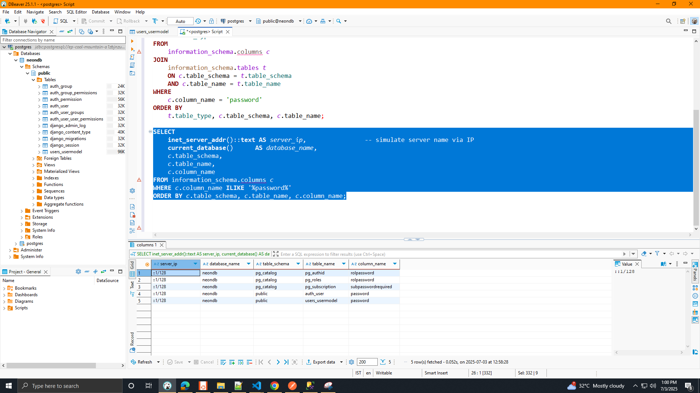
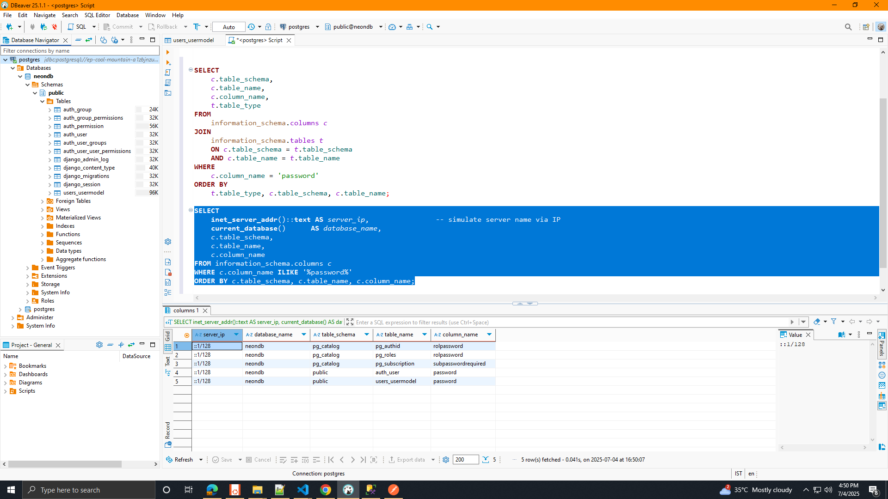

<!-- list server, schema, database name, table name , column name  from column name-->

```sql
SELECT
    inet_server_addr()::text AS server_ip,                -- simulate server name via IP
    current_database()      AS database_name,
    c.table_schema,
    c.table_name,
    c.column_name
FROM information_schema.columns c
WHERE c.column_name ILIKE '%password%'
ORDER BY c.table_schema, c.table_name, c.column_name;




-- Find Tables and Columns Related to Passwords in PostgreSQL
SELECT
    inet_server_addr()::text AS server_ip,                -- simulate server name via IP
    current_database()      AS database_name,
    c.table_schema,
    c.table_name,
    c.column_name
FROM information_schema.columns c
WHERE c.column_name ILIKE '%password%'
ORDER BY c.table_schema, c.table_name, c.column_name;


```
