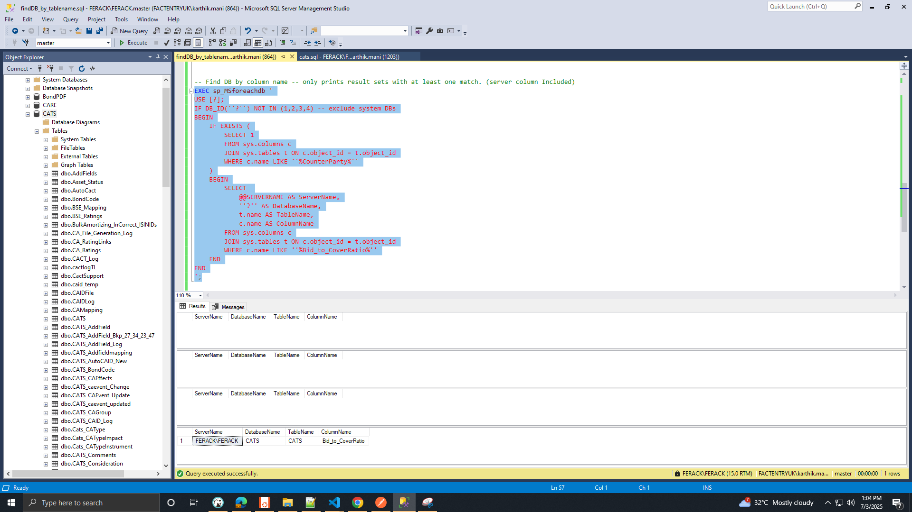

```SQL
EXEC sp_MSforeachdb '
IF EXISTS (
    SELECT 1
    FROM [?].INFORMATION_SCHEMA.TABLES
    WHERE TABLE_NAME = ''AddFields''
)
BEGIN
    PRINT ''Found in database: [?]'';
END
';





-- Find DB by Table name
EXEC sp_MSforeachdb '
IF EXISTS (
    SELECT 1
    FROM [?].INFORMATION_SCHEMA.TABLES
    WHERE TABLE_NAME = ''CATS_AddField''
)
BEGIN
    PRINT ''Found in database: [?]'';
END
';

-- Find DB by column name -- ALL
EXEC sp_MSforeachdb '
USE [?];
IF DB_ID(''?'') NOT IN (1,2,3,4) -- exclude system DBs if needed
BEGIN
    SELECT
        ''?'' AS DatabaseName,
        t.name AS TableName,
        c.name AS ColumnName
    FROM
        sys.columns c
    JOIN
        sys.tables t ON c.object_id = t.object_id
    WHERE
        c.name LIKE ''%CounterParty%''
END
';

-- Find DB by column name -- only prints result sets with at least one match.
EXEC sp_MSforeachdb '
USE [?];
IF DB_ID(''?'') NOT IN (1,2,3,4)
BEGIN
    IF EXISTS (
        SELECT 1
        FROM sys.columns c
        JOIN sys.tables t ON c.object_id = t.object_id
        WHERE c.name LIKE ''%CounterParty%''
    )
    BEGIN
        SELECT
            ''?'' AS DatabaseName,
            t.name AS TableName,
            c.name AS ColumnName
        FROM sys.columns c
        JOIN sys.tables t ON c.object_id = t.object_id
        WHERE c.name LIKE ''%Bid_to_CoverRatio%''
    END
END
';


-- Find DB by column name -- only prints result sets with at least one match. (server column Included)
EXEC sp_MSforeachdb '
USE [?];
IF DB_ID(''?'') NOT IN (1,2,3,4) -- exclude system DBs
BEGIN
    IF EXISTS (
        SELECT 1
        FROM sys.columns c
        JOIN sys.tables t ON c.object_id = t.object_id
        WHERE c.name LIKE ''%CounterParty%''
    )
    BEGIN
        SELECT
            @@SERVERNAME AS ServerName,
            ''?'' AS DatabaseName,
            t.name AS TableName,
            c.name AS ColumnName
        FROM sys.columns c
        JOIN sys.tables t ON c.object_id = t.object_id
        WHERE c.name LIKE ''%IndirectBidder%''
    END
END
';

-- Find DB by multiplecolumn name -- only prints result sets with at least one match. (server column Included)
EXEC sp_msforeachdb '
IF DB_ID(''?'') NOT IN (1,2,3,4) -- Exclude system DBs
BEGIN
    USE [?];

    SELECT
        @@SERVERNAME AS ServerName,
        ''?'' AS DatabaseName,
        s.name AS SchemaName,
        t.name AS TableName,
        c.name AS ColumnName
    FROM sys.columns c
    JOIN sys.tables t ON c.object_id = t.object_id
    JOIN sys.schemas s ON t.schema_id = s.schema_id
    WHERE c.name IN (
        ''Bid_to_CoverRatio'', ''ProRata'', ''AuctionTail'', ''LowYield'', ''HighYield'',
        ''LowPrice'', ''HighPrice'', ''OfferingAmount'', ''TotalTendered'',
        ''TenderedIndirectBidder'', ''TenderedDirectBidder'', ''TenderedPrimaryDealer'',
        ''TenderedSOMA'', ''AcceptedIndirectBidder'', ''AcceptedDirectBidder'',
        ''AcceptedPrimaryDealer'', ''AcceptedSOMA'', ''CompAmt'', ''NonCompAmt'',
        ''NonCompetitiveII'', ''RetentionQuote''
    )
END
';

```
